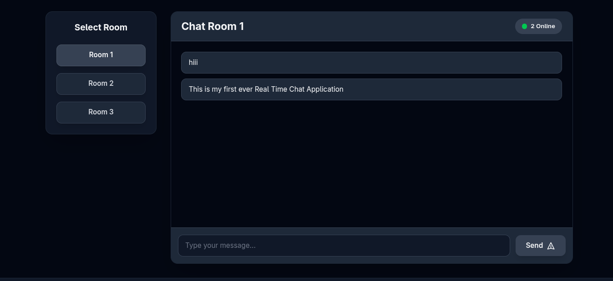
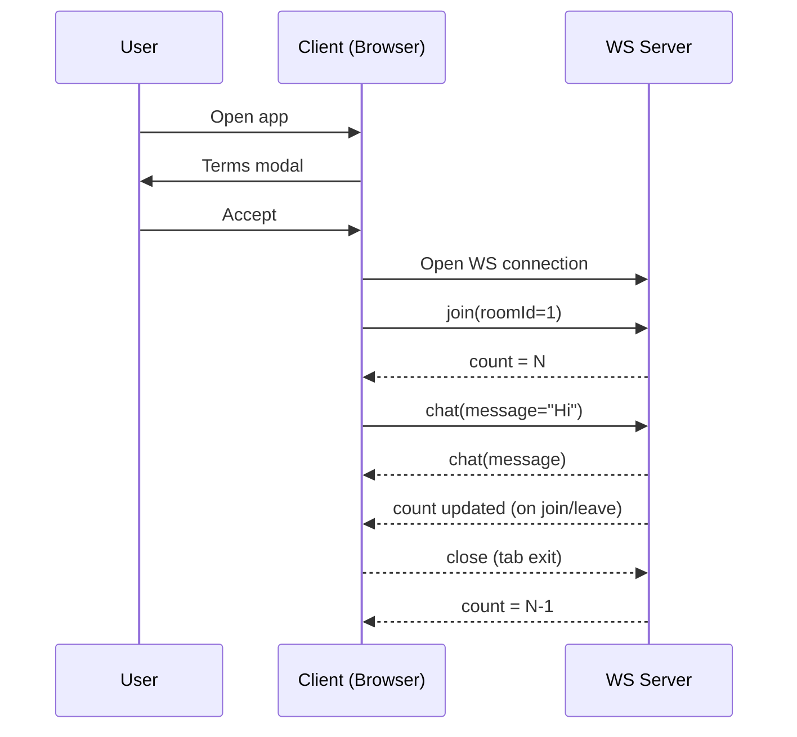

# Real-Time WebSocket Chat (No Data Storage)



A minimal real-time chat application using a WebSocket server and a React (Vite + TypeScript + Tailwind CSS) client. Messages are relayed only in real time and never stored.

## Features
- Multi-room chatting (select room 1 / 2 / 3)
- Live online user count per room
- Real-time message relay (WebSocket)
- Mobile + desktop responsive dark UI
- No persistence: nothing written to disk or memory beyond active connections
- Clear legal disclaimer modal before usage

## Tech Stack
- Frontend: React 18, TypeScript, Vite, Tailwind CSS
- Backend: Node.js + ws (WebSocketServer)
- Transport: JSON messages (types: join, chat, count)

## Project Structure
```
client/      React frontend
server/      WebSocket server
show.png     Screenshot used in README
```

## System Architecture

### Message Flow (Sequence)


### Data Handling
- In-memory only: active sockets per room.
- No persistence layer.
- Counts recalculated on join/leave.
- Disclaimer enforced before any interaction.

## Getting Started

### 1. Clone
```
git clone <repo-url>
cd 16/1.2
```

### 2. Install
```
cd server && npm install
cd ../client && npm install
```

### 3. Environment (optional)
Create client/.env:
```
VITE_WS_URL=ws://YOUR_SERVER_IP:8080
```
If unset, client auto-detects: ws://<browser-hostname>:8080

### 4. Run Server
From /server:
```
npm run dev
```
Bind is set to 0.0.0.0 for LAN access:
```ts
new WebSocketServer({ host: '0.0.0.0', port: 8080 });
```

### 5. Run Client
From /client:
```
npm run dev
```
Open from another device on same LAN:
```
http://YOUR_SERVER_IP:5173
```
The WebSocket URL resolves dynamically.

## WebSocket Message Format

### Join
```json
{ "type": "join", "payload": { "roomId": 1 } }
```

### Chat
```json
{ "type": "chat", "payload": { "roomId": 1, "message": "Hello" } }
```

### Count (server broadcast)
```json
{ "type": "count", "count": 3 }
```

## Adding Rooms
Increment the buttons in App.tsx and reuse same logic. The server map dynamically accepts any roomId key.

## Deployment Notes
- Serve client over HTTP/HTTPS.
- Keep WebSocket server port open (8080).
- Use reverse proxy (Nginx) if deploying behind TLS:
  - Web: HTTPS (443)
  - WS: wss://yourdomain.com/chat (proxy to 8080)

## Security / Legal Disclaimer
This application:
- Does NOT log, store, archive, or retain messages.
- Does NOT track user identities, IPs, or historical activity.
- Acts ONLY as a transient relay between connected peers.

Users:
- Are solely responsible for all transmitted content.
- Must NOT send illegal, abusive, hateful, harmful, or infringing material.
- Must comply with applicable laws.

Developer:
- Has no access to past messages, no moderation capability, and no historical data.
- Provides software AS IS without warranties or guarantees.
- Is not liable for user actions or misuse.

By accepting the in-app disclaimer, users agree to indemnify and hold harmless the developer.

## Troubleshooting

| Issue | Fix |
|-------|-----|
| Phone cannot connect | Ensure both devices on same LAN; use server IP not localhost |
| Count not updating | Verify JSON parse and message type 'count' |
| CORS / mixed content on HTTPS | Use wss:// when site served via HTTPS |
| Long words overflow | Tailwind classes include break-words / whitespace-pre-wrap |

## Scripts (Client)
```
npm run dev      # start Vite
npm run build    # production build
npm run preview  # preview build
```

## Scripts (Server)
```
npm run dev      # start WebSocket server
```

## License
Add a license section if needed (e.g., MIT). Currently unspecified.

## Contact
For legal or compliance inquiries only: your@email.com

---
Minimal, transparent, real-time. No storage. Use responsibly.